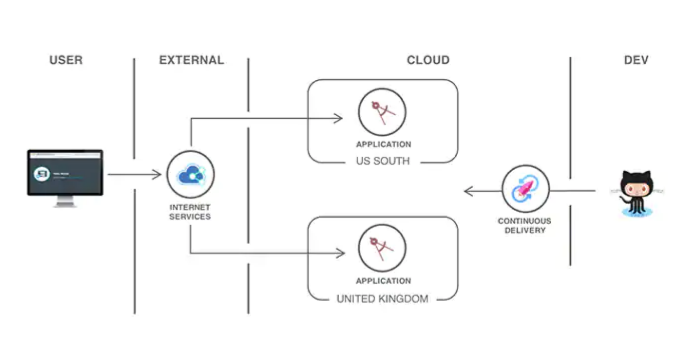
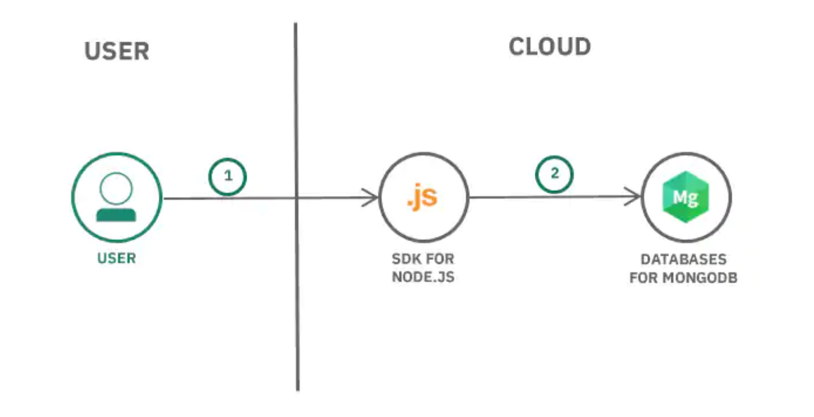
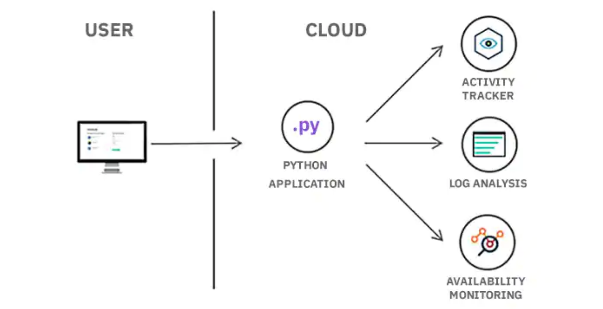

# Bootcamp-Cloud-Apps
En este bootcamp conoceras las herramientas de IBM Cloud, asosciadas con **Cloud Foundry**. Que te permitira desplegar y escalar apps sin configuraciones manuales y mantenimiendo servidores.

Estas herramientas las encontraras en [![IBM Cloud Powered][img-ibmcloud-powered]][url-ibmcloud]
Podras encontrar más información en [![IBM Cloud Foundry][img-ibmcloudfoundry]][url-ibmcloudfoundry]

## ¿Qué es Cloud Foundry?
Cloud Foundry asegura que el desarrollo e implementación de la codificación sigan siendo cuidadosamente coordinados con cualquier servicio adjunto, lo que genera una rápida, consistente y confiable iteración de aplicaciones.

Puede implementar aplicaciones web de manera segura en varias regiones.

 
Puede tener una aplicacion que esta compuesta por un tiempo de ejecución de **Mongo DB**, con una infraestructura web express, front Angular y tiempo de ejecución NodeJS.

 
O puede tener una analisis de registros supervisar estados de una aplicación.

Puedes encontrar más información en el siguiente video: [![YouTube][img-youtube]][youtube-url]

## Conoceras que herramientas como:
1. ### Functions de IBM Cloud.  
Plataforma de IBM cloud de programacion poliglota FaaS (Functions-as-a-Service) para desarrollo de codigo ligero que escala dependiendo de la demanda.

Para mayor informacion: [![Functions][img-cloud-functions]][url-ibmcloud-Functions] 

[img-youtube]: https://img.shields.io/badge/IBM%20Cloud-YouTube-red.svg
[youtube-url]: https://www.youtube.com/watch?time_continue=14&v=oUpqXxmr6oU&feature=emb_logo
[img-ibmcloud-powered]: https://img.shields.io/badge/IBM%20Cloud-Powered-blue.svg
[url-ibmcloud]: https://www.ibm.com/cloud/
[img-cloud-functions]: https://img.shields.io/badge/IBM%20cloud-Functions-red.svg
[url-ibmcloud-Functions]: https://www.ibm.com/cloud/functions
[img-ibmcloudfoundry]: https://img.shields.io/badge/IBM-Cloud%20Foundry.blue.svg
[url-ibmcloudfoundry]: https://www.ibm.com/cloud/cloud-foundry
